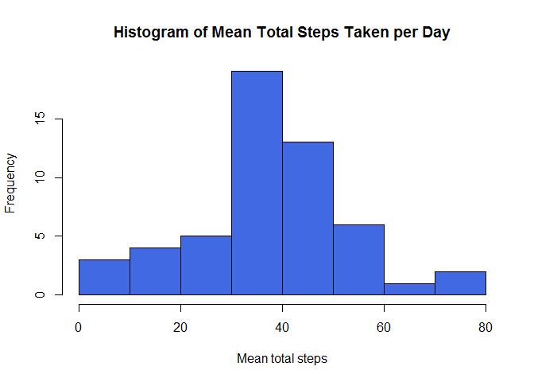
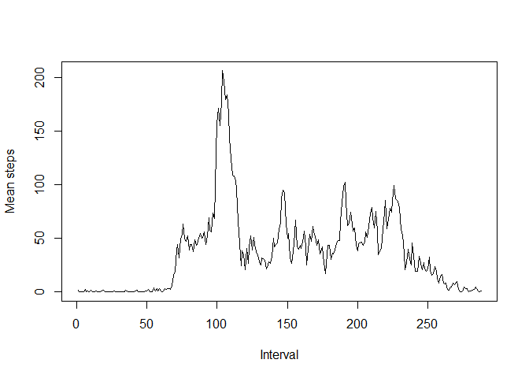
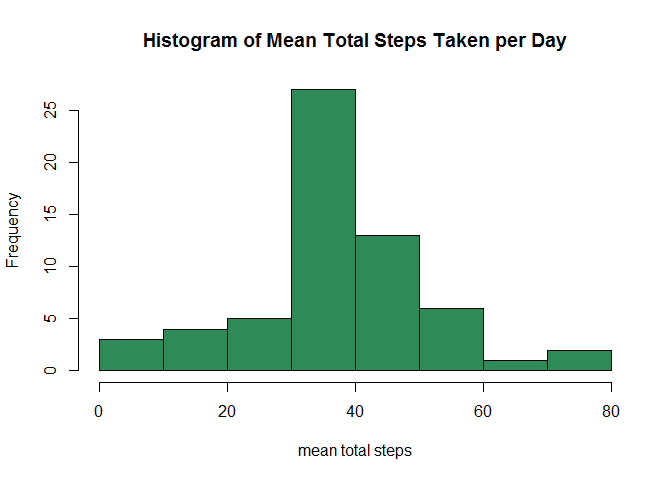
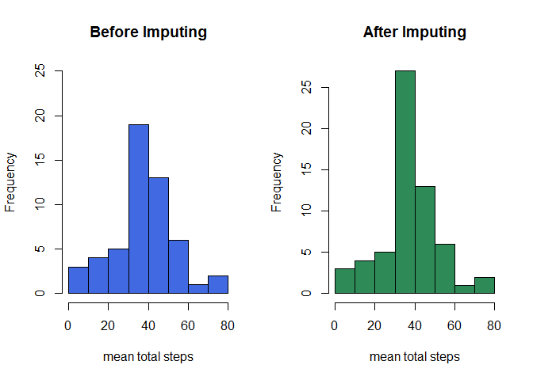
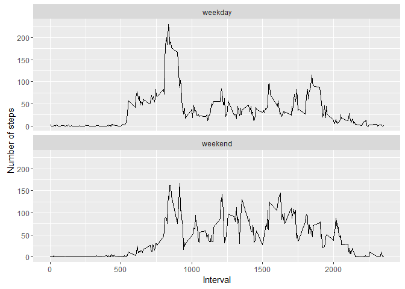

# Reproducible Research: Peer Assessment 1


## Loading and preprocessing the data  

#### 1. Load the data

```r
activity <- read.csv("activity.csv")
```

## What is mean total number of steps taken per day? 

#### 1. calculate the total number of steps taken per day and get histogram

```r
stepmean <- with(activity, tapply(steps, date, mean))
hist(stepmean, col="royalblue", xlab="Mean total steps",
     main="Histogram of Mean Total Steps Taken per Day")
```

<!-- -->

#### 2. get mean and median  

```r
mean(stepmean, na.rm=T)
```

```
## [1] 37.3826
```

```r
median(stepmean, na.rm=T)
```

```
## [1] 37.37847
```


## What is the average daily activity pattern?

#### 1. make a time series plot using `plot()`

```r
actPat <- with(activity, tapply(steps, interval, mean, na.rm=T))
plot(actPat, type="l", xlab="Interval", ylab="Mean steps")
```

<!-- -->

#### 2. get the interval which contains maximum number of steps taken on average
   by using `which.max()`

```r
minute <- as.numeric(names(which.max(actPat)))
```
##### **The interval which contains maximum number of steps is `835`**


## Imputing missing values

#### 1. get total number of rows with NAs by using `complete.cases()`

```r
sum(complete.cases(activity))
```

```
## [1] 15264
```

#### 2. imputing missing values using 'for' loop

```r
actNew <- activity
      for (aa in 1:nrow(actNew)) {
            if (is.na(actNew$steps[aa])) {
                  actNew$steps[aa] <- actPat[as.character(actNew$interval[aa])]
            }
      }
```
New data set "actNew" is created.

#### 3. make a histogram

```r
stepmean2 <- with(actNew, tapply(steps, date, mean))
hist(stepmean2, col="seagreen", xlab="mean total steps",
     main="Histogram of Mean Total Steps Taken per Day")
```

<!-- -->

```r
mean(stepmean2, na.rm=T)
```

```
## [1] 37.3826
```

```r
median(stepmean2, na.rm=T)
```

```
## [1] 37.3826
```

#### 4. Comparision

```r
par(mfrow=c(1,2))
hist(stepmean, col="royalblue", xlab="mean total steps",
     main="Before Imputing", ylim=c(0,25))
hist(stepmean2, col="seagreen", xlab="mean total steps",
     main="After Imputing")
```

<!-- -->

- median of second graph gets increased from 37.3785 to 37.3826 which is same
value with mean.
- Since missing values were replaced by mean for that 5-minute interval,
frequency of most frequent bin was increased a lot.

## Are there differences in activity pattenrs between weekdays and weekends?

#### 1. create a new factor variable called "day" using `dplyr` package

```r
library(dplyr)
```
Set language as English

```r
Sys.setlocale("LC_ALL", "English")
```
Use `mutate()` to create new variable

```r
actNew <- mutate(actNew, 
                 day=factor(1*(weekdays(as.Date(date))=="Saturday" |
                                     weekdays(as.Date(date))=="Sunday"),
                                labels=c("weekday","weekend")))
```

#### 2. make a panel plot containing a time series plot using `ggplot2` package

```r
library(ggplot2)
g <- ggplot(actNew, aes(interval, steps))
g + facet_wrap(~day, nrow=2) + stat_summary(fun.y="mean", geom="line") +
      labs(x="Interval", y="Number of steps")
```

<!-- -->

